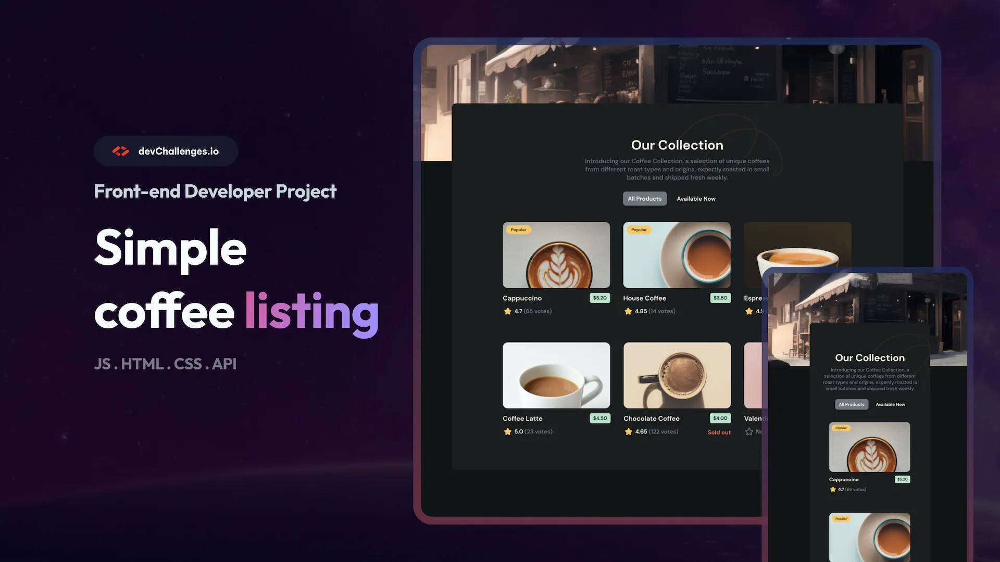
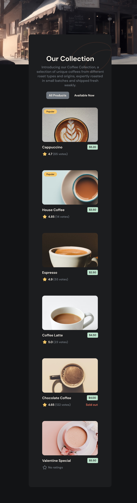
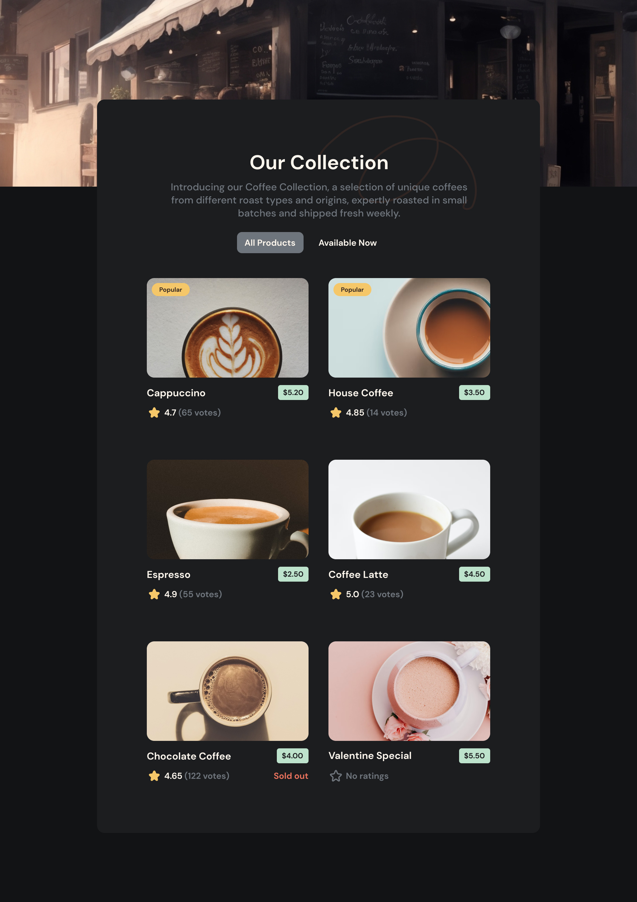
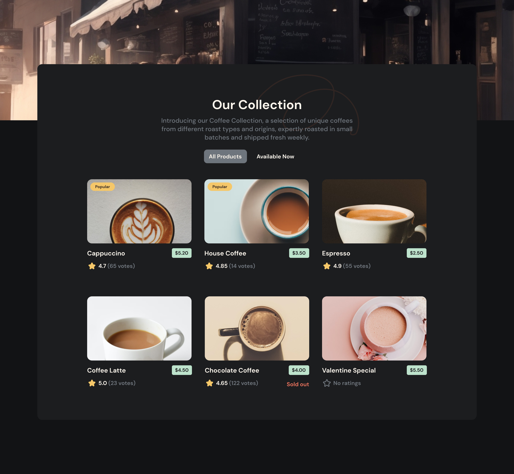

# DevChallenges's Simple Coffee Listing challenge

- used url query pattern to change displayed coffee listing.



## Design

| 640px                         | 1024px                         | 1280                          |
| ----------------------------- | ------------------------------ | ----------------------------- |
|  |  |  |

## Built with

- Vue 3 (Options API)
- Vue Router
- CSS3

## Project Links

- Live Site URL: [here](https://simple-coffee-listing-phi.vercel.app/)
- DevChallenges Solution URL: [here](https://devchallenges.io/solution/4875)

## Project setup

```
npm install
```

### Compiles and hot-reloads for development

```
npm run serve
```

### Compiles and minifies for production

```
npm run build
```

### Customize configuration

See [Configuration Reference](https://cli.vuejs.org/config/).
